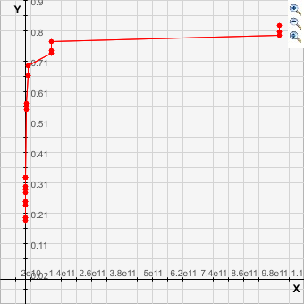

### Exercise 1.24.

Modify the `timed-prime-test` procedure of exercise 1.22 to use `fast-prime?`
(the Fermat method), and test each of the 12 primes you found in that exercise.
Since the Fermat test has &Theta;(`log` *n*) growth, how would you expect the
time to test primes near 1,000,000 to compare with the time needed to test
primes near 1000? Do your data bear this out? Can you explain any discrepancy
you find?

### Solution

See `24.scm` for the complete procedure. The times should be expected to bear
resemblance to the &Theta;(`log` *n*) order of growth, therefore primes near
1,000,000 should take approximately twice as long to test compared to primes
near 1000. The times shown for the larger primes near 1,000,000,000,000 should
therefore take approximately 1.3 times the amount of time as the primes near
1,000,000,000.

Below is the complete output for the procedure, running the Fermat test 10000
times for each `fast-prime?` call.

```
1009 *** .19
1013 *** .2
1019 *** .19999999999999996
10007 *** .25
10009 *** .2500000000000001
10037 *** .24
100003 *** .28
100019 *** .2999999999999998
100043 *** .29000000000000004
1000003 *** .33000000000000007
1000033 *** .33000000000000007
1000037 *** .33000000000000007
*** ***
1000000007 *** .5599999999999996
1000000009 *** .5499999999999998
1000000021 *** .5700000000000003
10000000019 *** .6600000000000001
10000000033 *** .6600000000000001
10000000061 *** .6899999999999995
100000000003 *** .7300000000000004
100000000019 *** .7399999999999993
100000000057 *** .7700000000000014
1000000000039 *** .7899999999999991
1000000000061 *** .8200000000000003
1000000000063 *** .7999999999999989
```

Below is the plotted data for the procedure, a plot of the input value versus
the resulting time:


