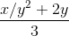

### Exercise 1.8.
Newton's method for cube roots is based on the fact that if *y* is an approximation to the cube root of *x*, then a better approximation is given by the value



Use this formula to implement a cube-root procedure analogous to the square-root procedure. (In section 1.3.4 we will see how to implement Newton's method in general as an abstraction of these square-root and cube-root procedures.)

### Solution
```scheme
(define (square x) (* x x))
(define (cube x) (* x x x))

(define (average x y)
  (/ (+ x y) 2))

(define (improve guess x)
  (average guess 
           (/ (+ (/ x (square guess))
                 (* guess 2))
              3)))

(define (good-enough? guess x)
  (< (abs (- (improve guess x) guess))
     (* guess 0.001)))

(define (cube-root-iter guess x)
  (if (good-enough? guess x)
      guess
      (cube-root-iter (improve guess x)
                      x)))

(define (cube-root x)
  (cube-root-iter 1.0 x))
```
