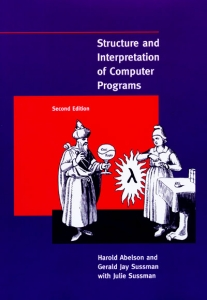

# sicp
Solutions to exercises from "Structure and Interpretation of Computer Programs", second edition, by Abelson, Sussman and Sussman.

## Information
Solutions are written in scheme and can be found in each exercise's markdown (`.md`) file or in its own source file. Some exercises require no code. 

The book and more information is available at <https://mitpress.mit.edu/sicp/>.
